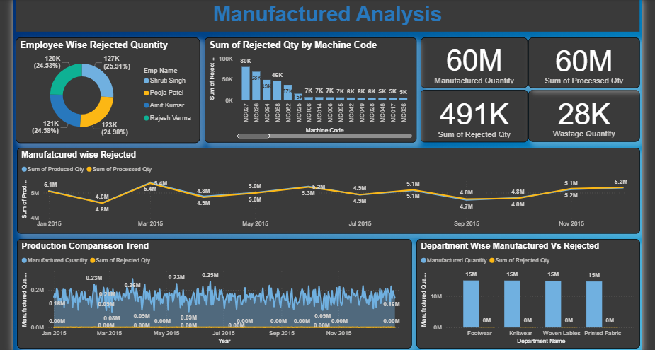

# manufacturing-analysis-powerbi-dashboard
Interactive Manufacturing Analysis Dashboard built using Power BI to analyze production performance, rejected quantity, machine efficiency, wastage tracking, and departmental manufacturing insights through data-driven visualization.

# Manufacturing Analysis Dashboard (Power BI)

## Project Overview

This project is an interactive Manufacturing Analysis Dashboard developed using Power BI. The dashboard provides detailed insights into manufacturing performance, processed quantity, rejected quantity, wastage analysis, machine efficiency, employee rejection analysis, and departmental production trends.

The main objective of this project is to transform raw manufacturing data into meaningful business insights that help improve production efficiency, reduce rejection rates, and support operational decision-making.

---

## Dashboard Preview

---

## Key KPIs

* Manufactured Quantity: 60M
* Processed Quantity: 60M
* Rejected Quantity: 491K
* Wastage Quantity: 28K

---

## Dashboard Features

* Employee-wise Rejected Quantity Analysis
* Machine-wise Rejected Quantity Monitoring
* Manufactured vs Processed Quantity Trend
* Production Comparison Trend
* Department-wise Manufactured vs Rejected Analysis
* Manufacturing KPI Monitoring
* Production Performance Visualization
* Operational Efficiency Insights

---

## Tools & Technologies Used

* Power BI
* DAX
* Power Query
* Data Modeling
* Data Visualization
* Data Cleaning
* Business Intelligence

---

## Business Insights

* Manufacturing quantity remains consistently high throughout the year.
* Certain machines contribute significantly higher rejected quantities.
* Employee-wise rejection analysis helps identify quality and performance gaps.
* Wastage quantity is comparatively low compared to total production.
* Department-wise manufacturing output remains stable across categories.

---

## Project Objective

The objective of this dashboard is to help manufacturing businesses:

* Monitor production efficiency
* Reduce rejection and wastage
* Improve machine performance
* Track operational KPIs
* Support data-driven manufacturing decisions

---

## Files Included

* Power BI Dashboard File (.pbix)
* Dataset File (.csv / .xlsx)
* Dashboard Screenshot
* README.md

---

## Skills Demonstrated

* Data Analysis
* Dashboard Development
* Data Visualization
* Business Intelligence
* DAX Calculations
* Manufacturing Analytics
* Data Cleaning
* Analytical Thinking

---

## Future Improvements

* Add predictive maintenance analysis
* Add machine downtime monitoring
* Add production forecasting
* Add cost and profitability analysis
* Add real-time manufacturing tracking

---

## Author

Aniket Kamble
